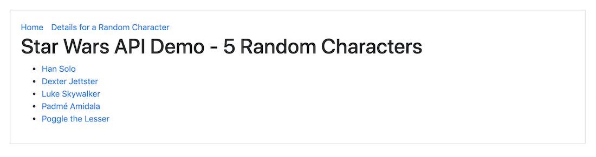
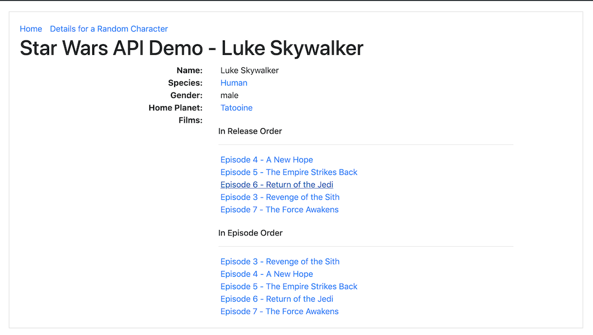

# NextJS Application that uses the Star Wars API 

This project was for the Full Stack Developer bootcamp I did and was for a lesson on fetching data with NextJS.

## Assignment
> * Create a new project using Next.js. This should be a dynamic website that is created using data retrieved from an API. You can use a simple API of your choice. Here are a few suggestions:
> > * [Rest countries API](https://restcountries.eu/#api-endpoints)
> > 
> > * [Musixmatch API](https://developer.musixmatch.com/documentation/api-methods)
> > 
> > * [Star Wars API](https://swapi.co)
> > 
> > * [Spotify API](https://developer.spotify.com/)
> 
> * The web app should contain at least two pages: an index page and a page that displays details about the topic that the user selects on the index page. 
> For example, if you create your app using the countries API you could display all the countries in a specific region (e.g. https://restcountries.eu/rest/v2/regionalbloc/eu) on the index page and all the details about the specific country selected by the user in the details page (e.g. https://restcountries.eu/rest/v2/name/austria).
> 
> * Be sure that your website is attractively styled and that you share a [layout component](https://nextjs.org/learn/basics/using-shared-components/the-layout-component) .

## Running the Code

[Clone / Download](https://github.com/dh4u/bootcamp-star-wars) the project to your computer.

### Start the code
Open command prompt / terminal for the project folder and then you can run:

#### `npm install`

This will install the node dependencies.

#### `npm start`

Runs the app in the development mode. 
Open [http://localhost:3000](http://localhost:3000) to view it in the browser.
